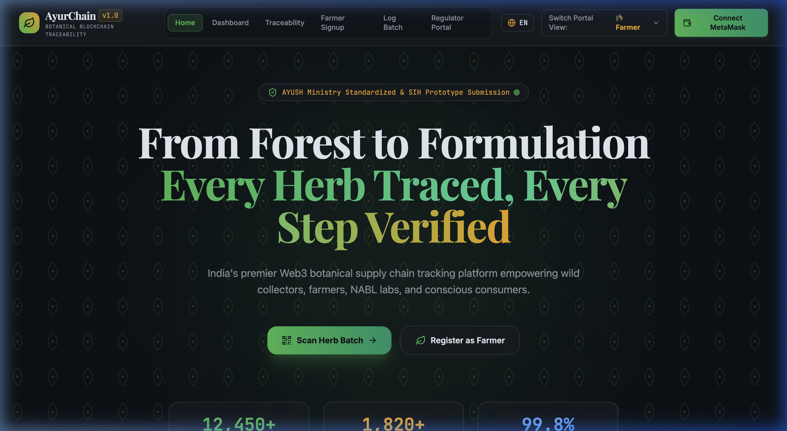
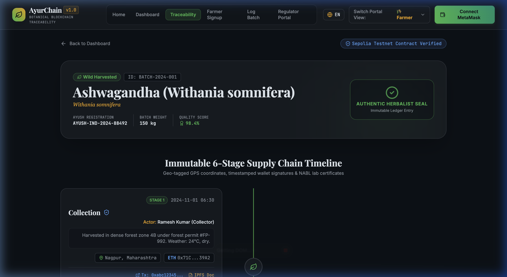
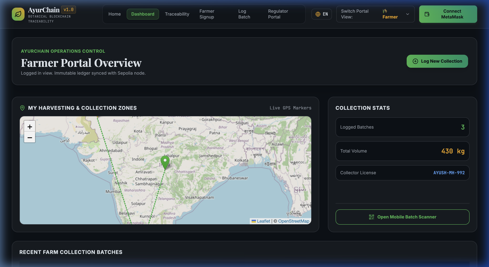
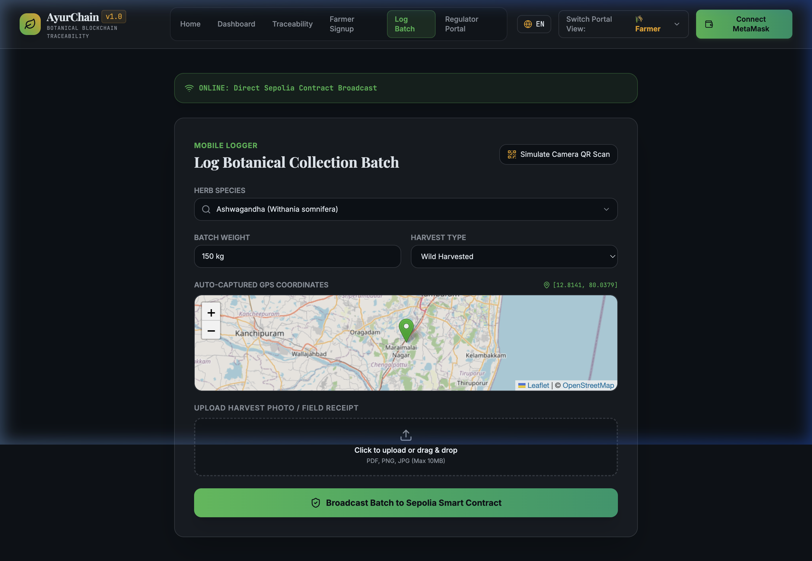
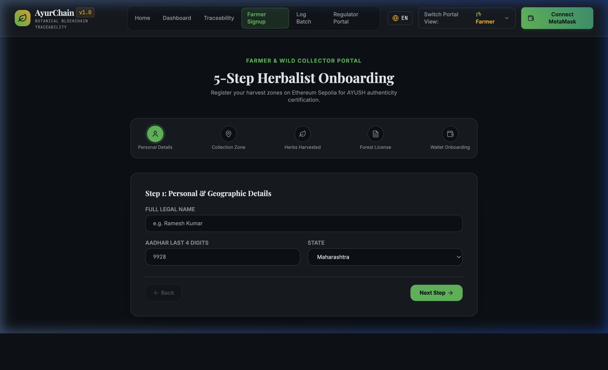
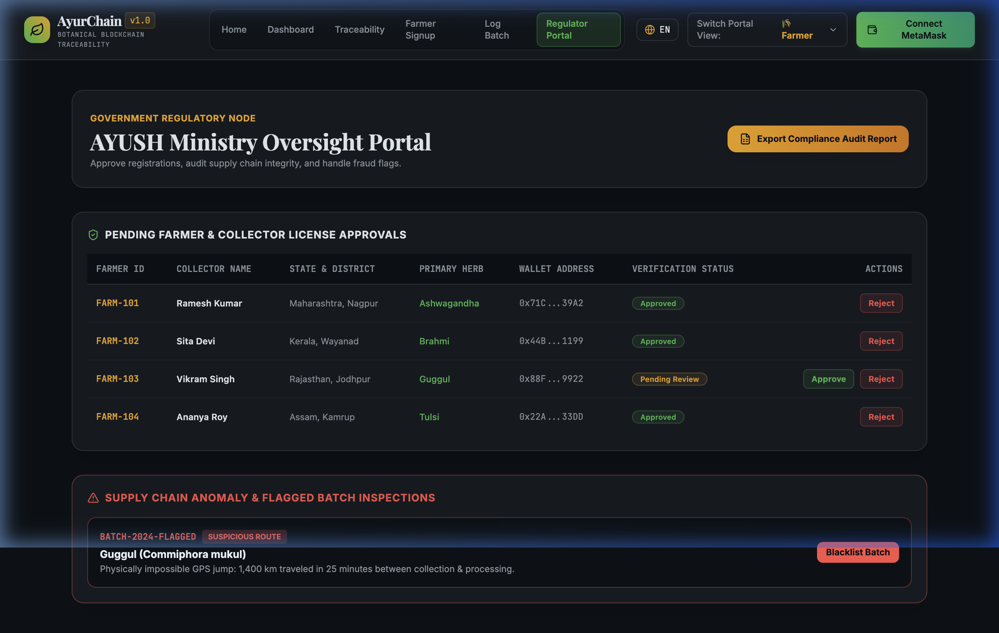
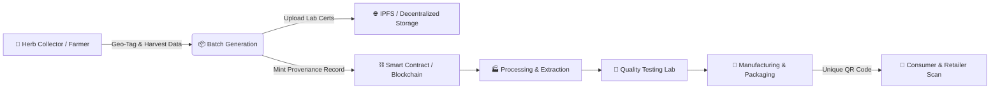

# 🌿 AyurChain — Blockchain Botanical Traceability System

[](LICENSE)
[](https://reactjs.org/)
[](https://tailwindcss.com/)
[](https://ethers.io/)
[](https://expressjs.com/)

> **AyurChain** is an end-to-end, immutable blockchain supply chain transparency platform designed for Ayurvedic herbs and botanical formulations. It tracks medicinal herbs from wild forest harvesting and organic cultivation through processing, lab testing, manufacturing, packaging, and retail distribution.

---

## 📌 Table of Contents
- [✨ Key Features](#-key-features)
- [📸 Application Screenshots](#-application-screenshots)
- [🏗 Architecture & Workflow](#-architecture--workflow)
- [⚡ Tech Stack](#-tech-stack)
- [🚀 Quick Start & Installation](#-quick-start--installation)
- [📄 License](#-license)

---

## ✨ Key Features

- **🌱 Farm-to-Pharma Traceability**: Track every stage of botanical sourcing with precise geo-location metadata, harvest timestamps, collector details, and batch certificates.
- **🔗 Decentralized Storage & Verification**: IPFS integration for storing tamper-proof quality control lab reports, organic certifications, and herb identity documentation.
- **🗺 Interactive Geo-Mapping**: Integrated geographical mapping to view exact harvesting regions across India and forest collection zones.
- **📱 Consumer QR Code Verification**: Instantly scan product QR codes to view full lineage, lab test results, carbon footprint metrics, and authentic harvest history.
- **🛡 Regulatory & Admin Dashboard**: Dedicated portals for quality control inspectors, lab verifiers, state forest departments, and AYUSH compliance regulators.
- **🦊 Multi-Wallet Support**: Seamless Web3 wallet connectivity via MetaMask, WalletConnect, and Coinbase Wallet.

---

## 📸 Application Screenshots

### 1. 🌐 Home Landing Portal
*Hero overview of the AyurChain ecosystem highlighting verified batch stats, live supply chain metrics, and botanical authenticity.*



---

### 2. 📍 Interactive Botanical Traceability Timeline
*Granular timeline showing complete herb provenance—from forest collection to quality inspection, extraction, and retail packaging.*



---

### 3. 📊 Supply Chain Operations Dashboard
*Live batch status monitoring, active inventory metrics, quality control status, and supply chain stage tracking.*



---

### 4. 📲 Consumer QR Scanner & Batch Lookup
*Direct QR scanning and manual batch lookup interface for consumers and retailers to verify herb purity.*



---

### 5. 👥 Stakeholder Onboarding & Registration
*Registration interface for farmers, collectors, processors, testing labs, and manufacturers.*



---

### 6. 🏛 Regulatory & Compliance Portal
*Admin dashboard for AYUSH officers and quality auditors to inspect pending verification requests and issue certifications.*



---

## 🏗 Architecture & Workflow



---

## ⚡ Tech Stack

| Layer | Technologies Used |
| :--- | :--- |
| **Frontend Framework** | React 18, Vite |
| **Styling & UI** | Tailwind CSS, Lucide Icons, Framer Motion |
| **Blockchain & Web3** | Ethers.js, IPFS (Pinata), Web3 Wallet Connectors |
| **Maps & Visualization** | Leaflet / React-Leaflet, Chart.js / Recharts |
| **Backend API** | Node.js, Express.js |

---

## 🚀 Quick Start & Installation

### Prerequisites
- Node.js (v18 or higher recommended)
- npm or yarn

### 1. Clone the Repository
```bash
git clone https://github.com/krishujha21/AyurChain.git
cd AyurChain
```

### 2. Frontend Setup
```bash
cd frontend
npm install
npm run dev
```
The frontend app will launch at `http://localhost:5173`.

### 3. Backend Setup
```bash
cd ../backend
npm install
npm run dev
```
The backend API server will run at `http://localhost:5000`.

---

## 📄 License

Distributed under the MIT License. See `LICENSE` for more information.
